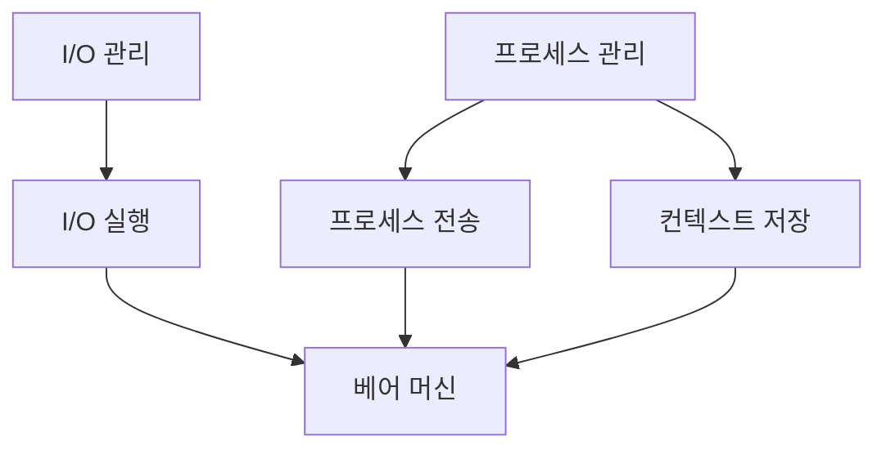

#### _운영 체제는 컴퓨터 하드웨어를 관리하는 소프트웨어이다_

-------------------------------------------------------------------
#### 운영 체제의 역사

| 년도        | 전자기기     | OS 장치 유형 |
| --------- | -------- | -------- |
| 1945~55   | 진공관      | 플러그 보드   |
| 1955~65   | 트랜지스터    | 배치 시스템   |
| 1965 ~ 80 | 집적회로(IC) | 멀티 프로그래밍 |
| 1980~     | 대규모 통합   | PC       |

-------------------------------------------------------------------
#### 운영 체제의 기능

- 리소스 관리
- 프로세스 관리
- 저장소 관리
- 메모리 관리
- 보안 / 개인정보 관리

-------------------------------------------------------------------
#### 운영 체제의 계층적 설계

베어 머신: [^baremachine]

-------------------------------------------------------------------
#### 운영 체제의 종류

- Windows
- MacOS
- Linux
- Unix

-------------------------------------------------------------------
#### 운영 체제의 목적

- 컴퓨팅 시스템 리소스의 할당과 사용 제어
- 하드웨어와 프로그래머 사이의 인터페이스 제공

-------------------------------------------------------------------
#### 운영 체제의 작업

- 프로그램과 파일을 만들고 수정하는 기능 제공
- 고급언어에서 기계어로 컴파일러에 접근
- 컴파일된 코드를 메모리로 옮기는 로더 프로그램 제공
- I/O 프로그래밍의 세부 사항을 처리하는 루틴 제공

> 각 I/O 장치에는 해당 장치와 연결된 별도 프로세스에 있는 장치 핸들러가 있다

-------------------------------------------------------------------
#### 특정 하드웨어 장치용 드라이버

###### 어셈블러
- 어셈블리어를 기계어 형태의 오브젝트 코드로 해석해주는 프로그램
- 기본 컴퓨터 명령어들을 비트 패턴으로 변환시키는 프로그램
###### 컴파일러
- 고급 언어를 저급 언어로 변환하는 프로그램
###### 인터프리터
- 고급 언어를 줄 별로 저급 언어로 변환하는 프로그램
###### 로더
- 프로그램을 메모리에 넣고 실행을 준비하는 프로그램

------------
#### 운영 체제의 구성 요소

###### 셸 (Shell)
- 운영 체제의 가장 바깥쪽 계층
- 사용자와 OS 간의 상호작용을 관리
- OS 에 대한 입력을 해석하고 출력을 처리

###### 커널 (Kernel)
- 운영 체제의 핵심 구성 요소
- 운영 체제와 하드웨어 간의 기본 인터페이스
- 시스템 호출 제어
- I/O 관리
- 애플리케이션 & 메모리 관리

--------
| | 64비트 OS | 32비트 OS |
| -- | -- | -- |
| 프로세서 | 64비트 | 64비트, 32비트 |
| 효율성 | O | X |
| 데이터 관리 | 다량 | 소량 |
| RAM 제한 | $2^{32}$ | $2^{64}$ |

----

#### 운영 체제의 장단점

###### 장점
- 메모리 관리
- 컴퓨터 하드웨어 활용
- 보안 유지
- 애플리케이션을 효율적으로 실행

###### 단점
- 사용하기 어려울 수 있음
- 일부 OS는 비용이 많이 들고 유지, 관리가 많이 필요

[^baremachine]: 운영 체제를 간섭하지 않고 논리 하드웨어에서 직접 명령을 실행하는 컴퓨터
